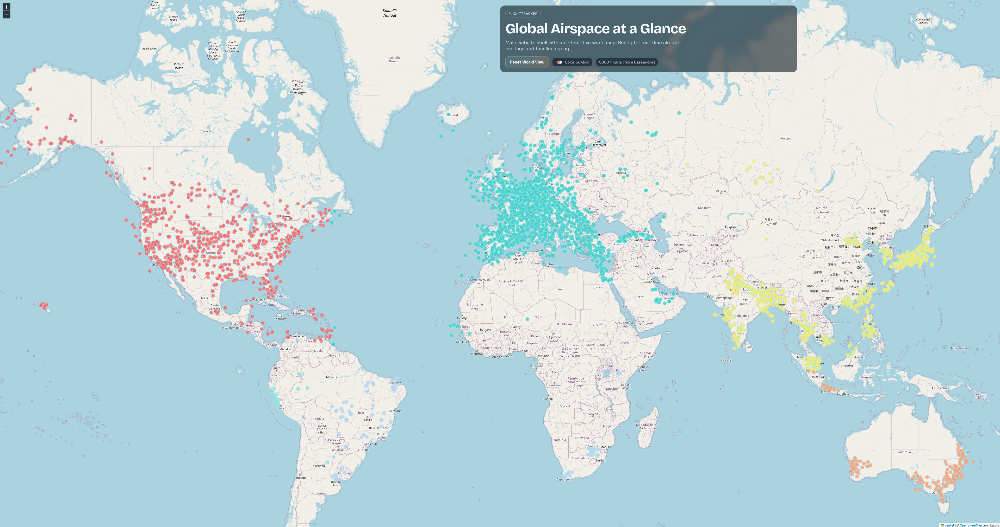

# FlightTracker

**FlightTracker** is a distributed system for ingesting, storing, and serving real-time global aircraft data at scale.

It is designed to handle high-throughput ingestion workloads, isolate read and write concerns, and provide a foundation for time-series analysis and historical flight replay.



---

## 🚀 Overview

FlightTracker ingests live aircraft state vectors from the OpenSky Network and exposes them through a read-optimized API and interactive web UI.

The system is built around a **write/read split architecture**, where ingestion and query workloads are decoupled to improve scalability and resilience.

---

## 🏗️ Architecture

```
OpenSky API (OAuth2)
        |
        v
api1..api6 (collector services, grid-scoped)
        |
        v
Cassandra cluster (cassandra1..3)
        |
        v
api-read (read service)
        |
        v
web (static frontend)
```

### Key Characteristics

- **Horizontally scalable ingestion**
  - Collector services operate on geographic grid partitions
  - New collectors can be added to increase throughput

- **Write/Read separation**
  - Collectors handle ingestion only
  - Reader service is optimized for query workloads

- **Distributed storage**
  - Cassandra cluster enables high write throughput and horizontal scaling

- **Stateless services**
  - All application services can be scaled independently

---

## ⚙️ Service Roles

- **api1..api6 (collectors)**
  - Run in `APP_MODE=collector`
  - Fetch aircraft state vectors from OpenSky
  - Persist latest state to Cassandra
  - Partition workload by geographic grid

- **api-read (reader API)**
  - Run in `APP_MODE=reader`
  - Serves `GET /api/states`
  - Optimized for low-latency reads

- **web**
  - Static frontend (Leaflet-based)
  - Polls reader API and renders aircraft positions globally

- **cassandra1..3**
  - Distributed datastore cluster
  - Stores aircraft state keyed by `icao24`

---

## 🧠 Design Decisions

### Write/Read Split
Separating ingestion from query handling:
- prevents read spikes from impacting ingestion
- enables independent scaling of collectors and API layer
- reflects real-world CQRS-style system design

---

### Grid-Based Ingestion
Collectors are scoped to geographic regions:
- distributes API load across multiple workers
- avoids rate limiting from upstream providers
- enables horizontal scaling by adding more partitions

---

### Cassandra as Storage Layer
Cassandra is used for its:
- high write throughput
- horizontal scalability
- predictable partition access patterns

Current model stores the **latest known state per aircraft (`icao24`)**, optimized for real-time queries.

---

## 📊 Data Model (Current)

- **Primary key:** `icao24`
- **Data stored:**
  - position (lat/lon)
  - velocity
  - altitude
  - timestamp

This model prioritizes:
- fast writes
- efficient point lookups
- low-latency reads for UI rendering

---

## ▶️ Quick Start

### 1. Configure credentials

Create `config/credentials.json`:

```json
{
  "clientId": "your-opensky-client-id",
  "clientSecret": "your-opensky-client-secret"
}
```

---

### 2. Build and run

```bash
docker compose up -d --build
```

---

### 3. Access services

- UI: http://localhost:8080  
- Reader health: http://localhost:8010/health  
- Sample query: http://localhost:8010/api/states?limit=5  

---

## ⚙️ Configuration

- Canonical config: `config/app-config.yml`
- Environment variables override YAML defaults
- Secrets loaded from:
  - environment variables
  - `config/credentials.json`

---

## 📈 Scaling Characteristics

- **Collectors**
  - scale horizontally by adding more grid partitions
  - ingestion throughput increases linearly with workers

- **Cassandra**
  - scales by adding nodes to the cluster
  - distributes writes across partitions

- **Reader API**
  - can be replicated behind a load balancer

---

## 🧪 Failure & Resilience Considerations

- Upstream API rate limits mitigated via distributed collectors
- Stateless services allow rapid restart and scaling
- Eventual consistency model aligns with real-time tracking use case
- System tolerates partial data gaps (missing aircraft updates)

---

## 🗺️ Roadmap

- [ ] **Historical flight replay (time-series model)**
  - append-only Cassandra table keyed by time
  - enable timeline scrubbing and playback

- [ ] Streaming pipeline (e.g., Kafka) between ingestion and storage
- [ ] WebSocket-based real-time updates (replace polling)
- [ ] Aircraft-level analytics (speed, altitude trends)
- [ ] Alerting (e.g., arrivals, delays, anomalies)

---

## 📚 Documentation

Detailed documentation:

- `doc/architecture.md`
- `doc/services.md`
- `doc/api.md`
- `doc/data-model.md`
- `doc/runtime-config.md`
- `doc/operations.md`

---

## 🧩 Summary

FlightTracker demonstrates:
- distributed system design
- ingestion pipeline architecture
- workload isolation via write/read split
- scalable data modeling with Cassandra

It is designed as a foundation for **real-time analytics and time-series flight data exploration**.
